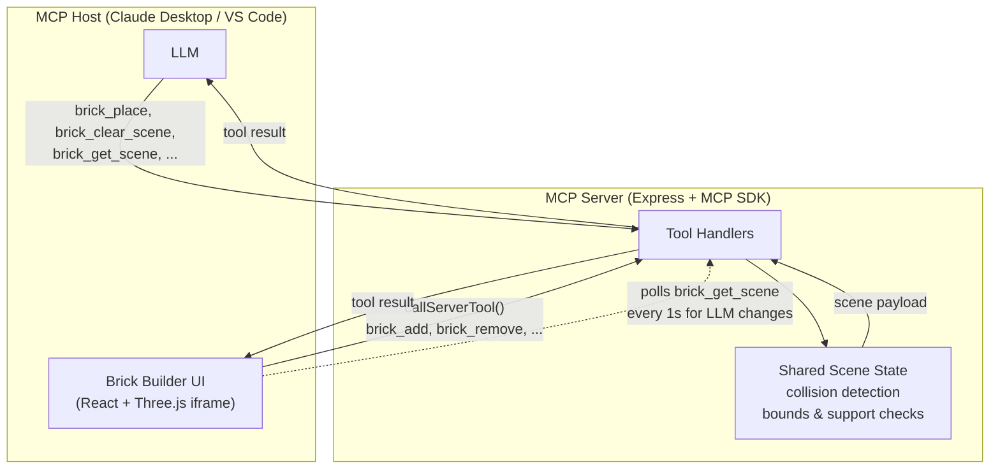
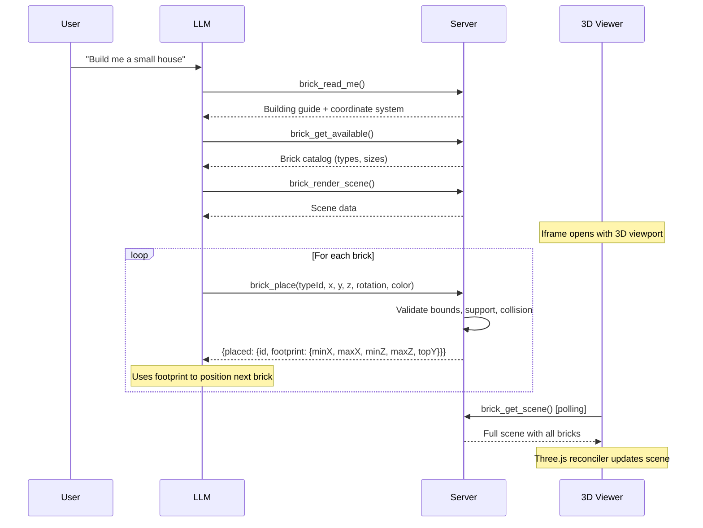
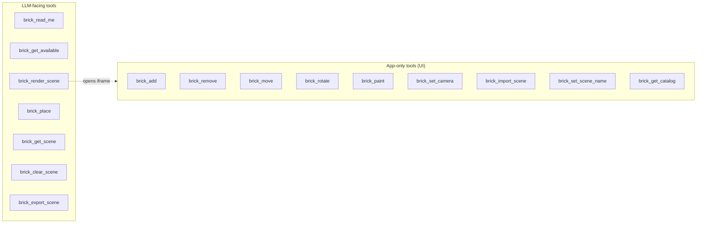
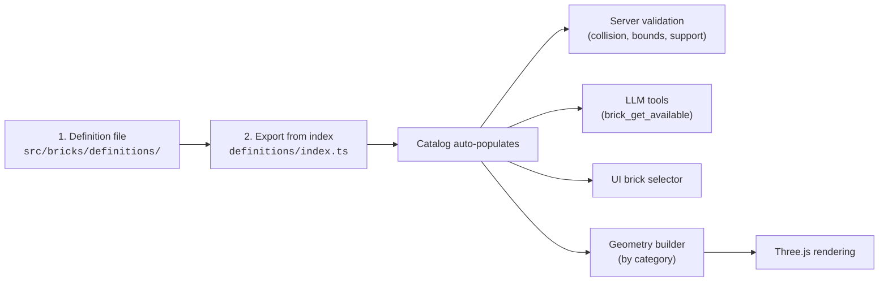
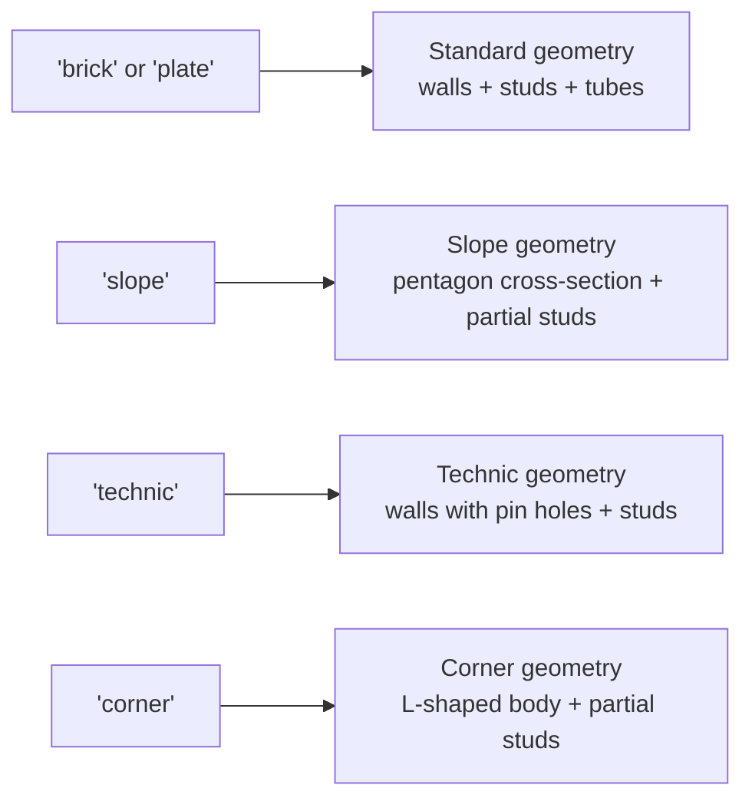

# Brick Builder MCP App

A Three.js MCP App for designing 3D brick constructions inside MCP-enabled hosts like Claude Desktop and VS Code. Build interactively in the 3D viewport or let the AI build structures for you through natural language.

<p align="center">
  
</p>

## Quick Start

```sh
git clone https://github.com/<owner>/brick-mcp-app.git
cd brick-mcp-app
npm install
npm run build
npm run serve
```

The server starts at **http://localhost:3001/mcp**.

### Prerequisites

- **Node.js** 20+
- **npm** 10+

### Commands

| Command | Description |
|---------|-------------|
| `npm install` | Install dependencies |
| `npm run build` | Build client (Vite) + server (esbuild) |
| `npm run serve` | Start server in dev mode (tsx, auto-reload) |
| `npm run dev` | Watch client + serve concurrently |
| `npm start` | Build then serve (one command) |

---

## Architecture

The server is the **single source of truth** for all scene state. Both the AI (LLM) and the interactive UI mutate state exclusively through MCP tools. The server validates every operation — collision detection, bounds checking, support verification — and returns authoritative results.



### Key Design Decisions

- **Shared module-level state**: The host creates separate MCP sessions for the LLM and the app iframe. Scene state lives at module level so both sessions read/write the same scene.
- **Polling for cross-session sync**: The UI polls `brick_get_scene` every second to pick up LLM-initiated changes. User-initiated changes (via `callServerTool`) are reflected instantly.
- **Single-brick placement**: The LLM places one brick per `brick_place` call and receives the placed brick's footprint in the response, enabling precise positioning of subsequent bricks.

---

## How It Works



---

## Connecting to Hosts

### Claude Desktop

Claude Desktop requires a stdio bridge for local HTTP servers. Use [`mcp-remote`](https://www.npmjs.com/package/mcp-remote) to proxy the connection.

**1. Build and start the server**

```sh
npm run build && npm run serve
```

**2. Edit your Claude Desktop config**

| Platform | Path |
|----------|------|
| macOS | `~/Library/Application Support/Claude/claude_desktop_config.json` |
| Windows | `%APPDATA%\Claude\claude_desktop_config.json` |
| Linux | `~/.config/Claude/claude_desktop_config.json` |

```json
{
  "mcpServers": {
    "brick-builder": {
      "command": "npx",
      "args": ["mcp-remote", "http://localhost:3001/mcp"]
    }
  }
}
```

**3. Restart Claude Desktop** and ask Claude to *"render the brick scene"* or *"build a small house"*.

### VS Code

VS Code supports streamable HTTP MCP servers natively. Create `.vscode/mcp.json` in your workspace:

```json
{
  "servers": {
    "brick-builder": {
      "type": "http",
      "url": "http://localhost:3001/mcp"
    }
  }
}
```

Or use the Command Palette: **MCP: Add Server** > **HTTP** > `http://localhost:3001/mcp`

### Claude Code (CLI)

```sh
claude mcp add --transport http brick-builder http://localhost:3001/mcp
```

---

## MCP Tools



### LLM Tools

| Tool | Description |
|------|-------------|
| `brick_read_me` | Returns the building guide, coordinate system, and examples |
| `brick_get_available` | Returns all brick types with IDs, dimensions, and categories |
| `brick_render_scene` | Opens the 3D viewer iframe (must call before placing bricks) |
| `brick_place` | Place a single brick. Returns placed brick with footprint for precise adjacent positioning |
| `brick_get_scene` | Read the current scene state with all bricks and their footprints |
| `brick_clear_scene` | Remove all bricks from the scene |
| `brick_export_scene` | Export as JSON or a human-readable summary |

### UI Tools (app-only, called via `callServerTool`)

| Tool | Description |
|------|-------------|
| `brick_add` | Add a single brick (click-to-place) |
| `brick_remove` | Remove a brick by ID |
| `brick_move` | Move a brick to a new position |
| `brick_rotate` | Set a brick's rotation (0/90/180/270) |
| `brick_paint` | Change a brick's color |
| `brick_set_camera` | Set camera position and target |
| `brick_import_scene` | Import a scene from JSON |
| `brick_set_scene_name` | Set the scene's display name |
| `brick_get_catalog` | Fetch the available brick types for the UI |

---

## Interactive UI

<p align="center">
  
</p>

The 3D viewport supports seven interaction modes, switchable via the toolbar or keyboard shortcuts:

| # | Mode | Shortcut | Action |
|---|------|----------|--------|
| 1 | Look | `1` | Orbit, pan, and zoom the camera. No brick interaction. |
| 2 | Place | `2` | Click the grid to place bricks. Ghost preview shows valid (green) or invalid (red) positions. |
| 3 | Select | `3` | Click a brick to select it (highlighted). |
| 4 | Move | `4` | Drag a brick to a new position. |
| 5 | Rotate | `5` | Click a brick to rotate it 90 degrees. |
| 6 | Delete | `6` | Click a brick to remove it. |
| 7 | Paint | `7` | Click a brick to change its color. |

**Additional shortcuts:**

| Key | Action |
|-----|--------|
| `R` | Cycle rotation (0 / 90 / 180 / 270) in place mode |
| `Delete` | Remove the selected brick |
| `Escape` | Deselect / cancel drag |

---

## Brick Types

20 brick types across three categories:

| Category | Types |
|----------|-------|
| **Bricks** (standard height, 3 plate units) | 1x1, 1x2, 1x3, 1x4, 1x6, 1x8, 2x2, 2x3, 2x4, 2x6, 2x8 |
| **Plates** (1/3 height, 1 plate unit) | 1x1, 1x2, 1x4, 2x2, 2x4, 2x6, 4x4 |
| **Slopes** (angled top) | 1x2, 2x2, 2x3 |

### Coordinate System

- **Baseplate**: 48 x 48 studs (X and Z axes)
- **Y axis**: Height in plate units (1 standard brick = 3 Y units)
- **Rotation**: 0, 90, 180, or 270 degrees (swaps X/Z dimensions)
- All positions are integers snapped to the stud grid

---

## Adding New Brick Types

Adding a new brick requires just two files. The catalog, server validation, geometry rendering, and UI selector all pick it up automatically.



### Step 1: Create the definition

Create a file in `src/bricks/definitions/`. The `BrickDefinition` interface:

```typescript
interface BrickDefinition {
  id: string;                  // Unique ID used in tool calls (e.g. 'brick_3x2')
  name: string;                // Display name (e.g. '3×2 Brick')
  category: 'brick' | 'plate' | 'slope' | 'technic' | 'corner';
  studsX: number;              // Width in studs (X axis)
  studsZ: number;              // Depth in studs (Z axis)
  heightUnits: number;         // Height in plate units (standard brick = 3, plate = 1)
  blockout?: BlockoutZone[];   // Optional zones where bricks can't sit on top (slopes)
}
```

**Example** — `src/bricks/definitions/brick_3x2.ts`:

```typescript
import type { BrickDefinition } from '../types.js';

const brick_3x2: BrickDefinition = {
  id: 'brick_3x2',
  name: '3×2 Brick',
  category: 'brick',
  studsX: 3,
  studsZ: 2,
  heightUnits: 3,
};

export default brick_3x2;
```

**Example with blockout** (slope) — the angled face blocks stud connections:

```typescript
const slope_2x3: BrickDefinition = {
  id: 'slope_2x3',
  name: '2×3 Slope 45°',
  category: 'slope',
  studsX: 2,
  studsZ: 3,
  heightUnits: 3,
  blockout: [{ minX: 0, maxX: 2, minZ: 1, maxZ: 3, height: 3 }],
};
```

### Step 2: Export from the index

Add one line to `src/bricks/definitions/index.ts`:

```typescript
export { default as brick_3x2 } from './brick_3x2.js';
```

### That's it

The brick is now:
- In `BRICK_CATALOG` (auto-populated from exports)
- Available to the LLM via `brick_get_available` and `brick_place`
- Shown in the UI brick selector panel
- Validated by server-side collision, bounds, and support checks
- Rendered with auto-generated geometry based on `category`

No changes to `server.ts`, `BrickBuilder.tsx`, or any other file.

### How categories map to geometry

The `category` field determines which geometry builder creates the 3D model:



| Category | Height convention | Geometry |
|----------|-------------------|----------|
| `brick` | `heightUnits: 3` (standard) | Rectangular with studs on top, hollow underneath |
| `plate` | `heightUnits: 1` (thin) | Same as brick, 1/3 height |
| `slope` | `heightUnits: 3` | Angled top face, studs only on flat portion |
| `technic` | `heightUnits: 3` | Pin holes in walls for axle connections |
| `corner` | `heightUnits: 1` | L-shaped body with partial stud grid |

### Adding a new category

To add an entirely new geometry style:

1. Create a geometry builder in `src/bricks/geometry/` (e.g. `cylinder.ts`)
2. Add a case to the switch in `src/bricks/geometry/index.ts`:
   ```typescript
   case 'cylinder': geometry = createCylinderGeometry(bt); break;
   ```
3. Add the category to the `BrickDefinition` type union in `src/bricks/types.ts`
4. Geometries must be **corner-origin** — spanning `[0, w] x [0, h] x [0, d]` in local space

### Unit reference

| Unit | World size | Real-world |
|------|-----------|------------|
| 1 stud (X/Z) | 1.0 | 8 mm |
| 1 plate unit (Y) | 0.4 | 3.2 mm |
| 1 standard brick (Y) | 1.2 (3 plates) | 9.6 mm |

---

## Testing with basic-host

You can test the app locally using the MCP Apps SDK basic-host:

```sh
# Terminal 1: start the server
npm run build && npm run serve

# Terminal 2: run basic-host
git clone --depth 1 https://github.com/modelcontextprotocol/ext-apps.git /tmp/mcp-ext-apps
cd /tmp/mcp-ext-apps/examples/basic-host
npm install
SERVERS='["http://localhost:3001/mcp"]' npm run start
# Open http://localhost:8080
```

---

## License

MIT — see [LICENSE](LICENSE).
